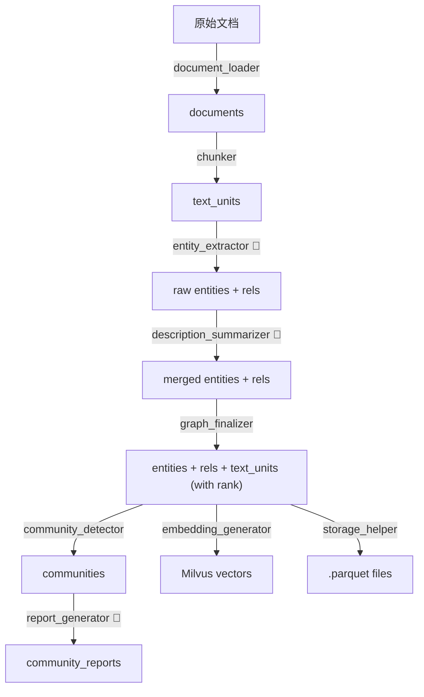

# kg_construct Pipeline 实现完成

## 文件结构

```
kg_construct/
├── pipeline.py               # 主编排（8步串联，async/sync 入口）
├── document_loader.py        # Step 1: 文档加载（txt/csv/json）
├── chunker.py                # Step 2: tiktoken 分块
├── entity_extractor.py       # Step 3: LLM 并发实体关系抽取
├── description_summarizer.py # Step 4: LLM 描述合并去重
├── graph_finalizer.py        # Step 5: NetworkX 计算 degree/rank
├── community_detector.py     # Step 6: Leiden 社区发现
├── report_generator.py       # Step 7: LLM 社区报告生成
├── embedding_generator.py    # Step 8: litellm + pymilvus
├── storage_helper.py         # Parquet 序列化辅助
└── prompts/
    ├── entity_extraction.txt
    ├── summarize_descriptions.txt
    └── community_report.txt
```

## 数据流



## 关键设计

| 特性 | 实现方式 |
|------|---------|
| LLM 并发 | `asyncio.Semaphore(concurrent_requests)` |
| JSON 解析容错 | 支持 markdown 代码块包裹、自动提取 JSON 对象 |
| 实体名标准化 | 统一转大写，避免大小写差异 |
| 描述合并优化 | ≤2条直接拼接，>2条调用 LLM 摘要 |
| Milvus 索引 | HNSW + COSINE |
